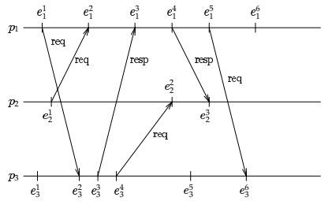
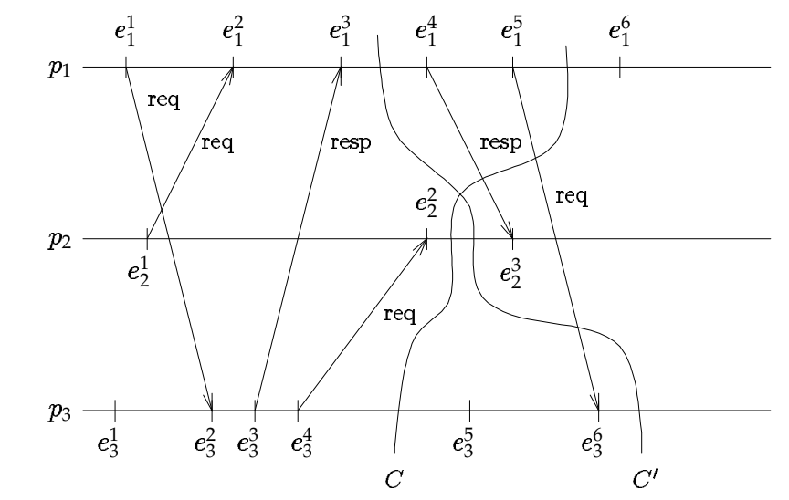
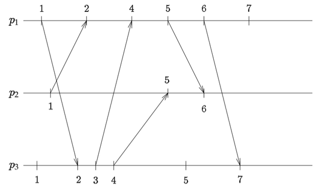

## Introduction
A **distributed system** is a kind of computer system consisting of a set of interconnected processes whose communications between them happen only by message exchange.

A large class of problem in distributed computing (monitoring, detection, load balancing) can be cast as executing some notification or reaction when the state of the system satisfies certain conditions. Thus, the ability to construct a **global state** and evaluate a predicate over such a state constitutes the core of solutions to many problems in distributed computing.

The **global state** of a distributed system is the _union of the states_ of the individual processes, which do not shares memory but communicate solely through exchange of messages. 

>[!important]
>The fundamental problem is to ensure that a global state constructed in this manner is meaningful.

---
## Asynchronous Distributed Systems
Distributed system is composed of:
- a collection of **processes** $p_1, p_2, ..., p_n$
- **communication channels** between pair of them for message exchange
Two models:
- **Asynchronous** (realistic for actual systems):
	- no bound on processes speeds and on message delay
	- synchronized to local clock
	- communications only mechanism for synchronization
- **Synchronous**:
	- processes speeds and message delays bounded

---
## Distributed Computations
#### Events
The execution of a distributed program by a collection of processes. Each process executes a sequence of ***events***, that can be internal or involve communications.

A communication event can be:
- $send(m)$ (enqueuing message for transmission to destination process)
- $receive(m)$ (dequeing message at destination process)
where  $m$ is the message identifier.
#### History
- *local history* of process $p_i$ is a sequence of event $h_i = e_i^1 e_i^2 ... e_i^n$, 
- history of the process $p_i$ containing the first $k$ events $h_i^k = e_i^1 e_i^2 ... e_i^k$
- *global history* is a set $H=h_1 \cup ... \cup h_n$
#### Happened-before (Causal precedence)
Global history does not specify timing between events, they can only be ordered based on *"cause-and-effect"* relationship: two events are considered to occur in a certain order only if the first affect the outcome of the second, either because they are from the same process or they are from different processes and they correspond to the exchange of a message.

The binary relation *happened-before* $\rightarrow$ is defined over events such that:
1. $e_i^k, e_i^\ell \in h_i \wedge k<\ell \Rightarrow e_i^k \rightarrow e_i^\ell$ 
2. $e_i = send(m) \wedge e_j = receive(m) \Rightarrow e_i \rightarrow e_j$ 
3. $e \rightarrow e' \wedge e' \rightarrow e'' \Rightarrow e \rightarrow e''$ (transitivity)
It denotes that if $e \rightarrow e'$ the outcome of $e'$ *may* have been influenced by $e$. 

It is possible that for some event $e$ and $e'$ neither $e \rightarrow e'$ nor $e' \rightarrow e$ so they are *concurrent* $e||e'$.

A distributed computation is a partially ordered set defined by $(H,\rightarrow)$.
#### Space-time diagram

>[!important] Figure 1 - Space time diagram
>

If a path can be traced from one event to the other left to right along the horizontal lines and in the sense of the arrow the are related, otherwise they are concurrent.
For example in the [[#|figure]] $e_2^1 \rightarrow e_3^6$ but $e_2^2 || e_3^6$ .

---
## Global States, Cuts and Runs
### Local State
$\sigma_i^k$ or $a_i^k$ denote the *local* state of process $p_i$ after the event $e_i^k$ is executed, so $\sigma_i^0$ is the initial state. The local state of a process may include information such as the values of local variables and the sequence of messages sent and received.
#### Global State
The *global* state of a distributed computation is an n-tuple of local states $\Sigma=(\sigma_1, \sigma_2, ..., \sigma_n)$ one for each process
#### Cut
A *cut* of a distributed computation is a subset $C$ of its global history $H$ and contains an initial prefix of each of the local histories.

It is denoted as $C=h_1^{c_1} \cup ... \cup h_n^{c_n}$ with the tuple of natural numbers $(c_1,...,c_n)$ corresponding to the index of the last event included for each process.

The set of last events $(e_1^{c_1},...,e_n^{c_n})$ included in a cut is called the *frontier* of the cut.

Each cut has a corresponding global state $(\sigma_1^{c_1}, ..., \sigma_n^{c_n})$.

>[!important] Figure 2 - Cuts
>

A cut is graphically represented as a partition of the space-time diagram along the time axis. In the figure there are two cuts $C$ corresponding to the tuple $(5,2,4)$ and $C'$ corresponding to $(3,2,6)$.

#### Runs
A *run* of a distributed computation is total ordering set $R$ that includes all of the events in the global history ordered by the effective time they occur and that is consistent with each local history. That is because all events occur in some total order even though a distributed computation is a partially ordered set ([[#Happened-before]]).

So for each process $p_i$ the events of $p_i$ appear in $R$ in the same order they appear in $h_i$. 

A run may not correspond to any possible execution and a single computation may have many possible runs.

---
## Monitoring Distributed Computations
**GPE (Global Predicate Evaluation)**  has the goal of determine the predicate $\Phi$ that is a function of the global state $\Sigma$. A single process $p_0$ called ***monitor*** is responsible for constructing $\Sigma$ and evaluating $\Phi$.

>[!warning] Assumption 
>We assume that monitoring events are external to the  computation and does not alter other events.

To construct the global state $p_0$ sends each process a "state enquiry" message and when $p_i$ receives it, it replies with its current local state $\sigma_i$. When all processes have replied $p_0$ can construct the global state.

>[!note]
>The positions of the processes local histories at the time the state enquiry messages are received defines a cut. 
>
>*The global state constructed by $p_0$ is the one corresponding to this cut* 

Given that the monitor process is part of the DS and is subject to the same uncertainties as any other process, this approach may lead to non-meaningful predicate values.

---
## Consistency
>[!Important] Definition
>A cut $C$ *is consistent* if for all events $e$ and $e'$ 
>$$
>(e \in C) \wedge (e' \rightarrow e) \Rightarrow e'\in C
>$$

In other words, a consistent cut is left closed under the [[#Happened-before|causal precedence relation]]. Graphically if all arrows that intersect the cut have their bases to the left and heads to the right of it, then the cut is consistent.

A consistent global state is one corresponding to a consistent cut.

A run $R$ is consistent if for all events, $e \rightarrow e'$ implies that $e$ appears before $e'$ in $R$.

---
## Delivery rules
An *observation* is a run constructed by a monitor process through notification messages. So a consistent observation is one that correspond to a consistent run.

The order of messages between pairs of process can be restored by defining a *delivery rule* for deciding when received message are to be presented to the application process.

>[!Note]
> - **deliver**: message presented to the application process
> - **receive**: message arrived at the destination process
#### FIFO Delivery
Communication from process $p_i$ to $p_j$ is said to satisfy *First-In-First-Out delivery* if for all messages $m$ and $m'$ 
$$
send_i(m) \rightarrow send_i(m') \Rightarrow deliver_j(m) \rightarrow deliver_j(m)
$$
FIFO prevents one message overtaking an earlier message sent by the same process.

>[!Warning]  Assumption
>Synchronous system
> - Global real-time clock
> - All message delays are bounded by $\delta$ (prof. call it *delivery upper-bound time* as $\Delta T$)

Let $TS(e)$ denote the value of the clock  when event $e$ is executed. When a process notifies $p_0$ of some local event $e$, it includes $TS(e)$ in the notification as a *timestamp*.
#### Delivery Rule 1 (DR1)
At time $t$, deliver all received message with timestamps up to $t-\Delta T$ in increasing timestamp order. This ensures that no future message can arrive with a timestamp smaller than any of the messages already delivered. 

>[!Important] Definition - **Clock Condition:** 
>Since the observation coincides with the delivery order, it is consistent if and only if
>$$
>e \rightarrow e' \Rightarrow TS(e) < TS(e')
>$$

This is certainly satisfied when timestamps are generated by a global real-time clock, but it can be satisfied even in an asynchronous system.

---
## Logical Clocks
In an asynchronous system no global real-time clock can exist, but other mechanisms can be used to satisfy the clock condition.
#### Lamport clock
Each process maintains a local variable $LC$ that maps events to positive natural numbers (at process start is set to 0). The value of the logical clock when event $e_i$ is executed by process $p_i$ is denoted $LC(e_i)$. And each message sent contains a timestamp $TS(m)$ which is the clock associated with the sending of the event. 

The clock is update by $p_i$ as follow:
$$
LC(e_i) := \begin{cases} LC + 1 & \text{if }e_i\text{ is an internal or send event} \\ max\{LC, TS(m)\} + 1 & \text{if }e_i = receive(m) \end{cases}
$$
The Lamport clock is updated to be greater than both of the previous local value and the timestamp of the incoming message.

>[!important] Figure 3 - Lamport Clock Space Time Diagram
>

>[!Note]
>Lamport clock values increase with respect to [[#Happened-before|causal precedence]] 

It is easy to verify that for any two events where $e \rightarrow e'$, the Lamport clocks associated with them are such that $LC(e)<LC(e')$, so the clock condition is satisfied.

>[!Fail] Problem
Considering a delivery rule where messages are delivered in increasing timestamp order, without message delivery upper-bound time no message will be delivered for fear of receiving a later message with a smaller timestamp.

>[!Important] Definition - **Gap-detection:**
> Given two events $e$ and $e'$ along with their clock values $LC(e)$ and $LC(e')$ where $LC(e) < LCe'$, determine whether some other event $e''$ exists such that $LC(e) < LC(e'') < LC(e')$.

Since each Lamport clock is monotone increasing and Using FIFO communication between all processes and $p_0$ preserves order among messages of the same process, when $p_0$ receives a message $m$ from process $p_i$ with timestamp $TS(m)$ it is certain that no other message $m'$ can arrive from $p_i$ such that $TS(m') \leq TS(m)$.

>[!Important] Definition - **Stable message**
>A message $m$ received by process $p$ is called ***stable*** if no future messages with timestamps smaller than $TS(m)$ can be received by $p$.

Given a FIFO communication between all processes and $p_0$, stability of message $m$ at $p_0$ can be guaranteed when $p_0$ has received at least one message from *all* other processes with a timestamp greater than $TS(m)$.

#### Delivery Rule 2 (DR2)
Deliver all received messages that are stable at $p_0$ in increasing timestamp order.

---
## Causal Delivery (CD)
More general abstraction extending FIFO ordering to all message that are causal related, even if they came from different processes.
$$
send_i(m) \rightarrow send_j(m') \Rightarrow deliver_k(m) \rightarrow deliver_k(m')
$$
for all messages $m,m'$ sending processes $p_i,p_j$ and destination process $p_k$.

If $p_0$ uses a delivery rule that satisfy CD all observation will be consistent.

---

# Constructing the Causal Precedence Relation
For implementing causal delivery efficiently, what is really needed is an effective procedure for deciding the following: given events $e, e'$ that are causally related and their clock values, does there exist some other event $e''$ such that $e \rightarrow e'' \rightarrow e '$  (i. e., $e''$ falls in the causal "gap" between $e$ and $e''$).

>[!fail] Problems
>By delivering event messages in strict increasing timestamp order, rules DR1 and DR2 assume that $TS(e)<TS(e')$ implies $e\rightarrow e'$. This is not necessarily true since timestamp generated with real-time or logical clocks only guarantee the clock condition, which is this implication in the opposite sense, so given $TS(e)<TS(e')$ it may be that $e\rightarrow e'$ or that they are concurrent (but never $e'\rightarrow e$).

>[!Important] Definition - **Strong clock condition**
>$$
>e \rightarrow e' \equiv TS(e)<TS(e')
>$$
## Vector Clocks
