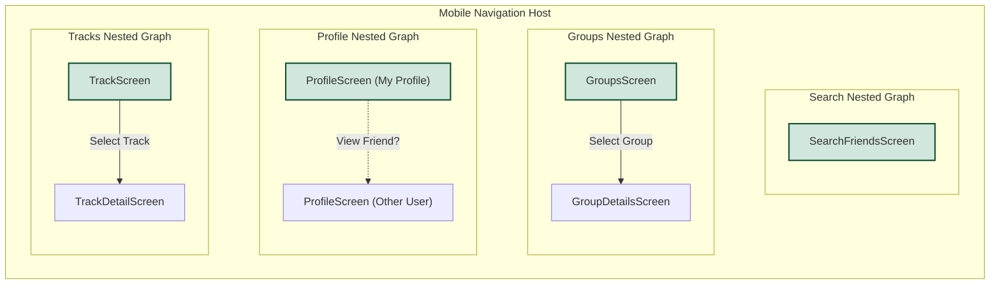

```mermaid
graph TD
    %% Main NavHost
    subgraph NavHost [Mobile Navigation Host]
        
        %% Track Flow (Start Destination)
        subgraph TrackFlow [Tracks Nested Graph]
            direction TB
            T_Main[TrackScreen]
            T_Detail[TrackDetailScreen]
            
            T_Main -->|Select Track| T_Detail
        end

        %% Profile Flow
        subgraph ProfileFlow [Profile Nested Graph]
            direction TB
            P_Main["ProfileScreen (My Profile)"]
            P_User["ProfileScreen (Other User)"]
            
            P_Main -.->|View Friend?| P_User
        end

        %% Group Flow
        subgraph GroupFlow [Groups Nested Graph]
            direction TB
            G_Main[GroupsScreen]
            G_Detail[GroupDetailsScreen]
            
            G_Main -->|Select Group| G_Detail
        end

        %% Search Flow
        subgraph SearchFlow [Search Nested Graph]
            S_Main[SearchFriendsScreen]
        end

    end

    %% Note on switching
    TrackFlow ~~~ ProfileFlow
    ProfileFlow ~~~ GroupFlow
    GroupFlow ~~~ SearchFlow
    
    %% Styling
    classDef startNode fill:#d1e7dd,stroke:#0f5132,stroke-width:2px;
    class T_Main,P_Main,G_Main,S_Main startNode;

```
