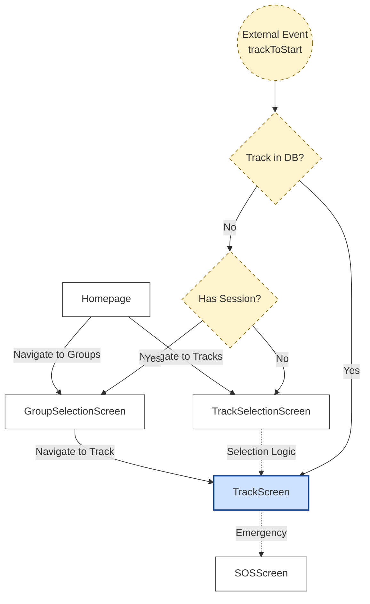

```mermaid
graph TD
    %% Nodes
    Home[Homepage]
    TrackSel[TrackSelectionScreen]
    GroupSel[GroupSelectionScreen]
    Track[TrackScreen]
    SOS[SOSScreen]
    
    %% External Logic Node
    StartLogic(("External Event<br/>trackToStart"))
    CheckDB{"Track in DB?"}
    CheckSession{"Has Session?"}

    %% Standard Navigation Flow
    Home -->|Navigate to Tracks| TrackSel
    Home -->|Navigate to Groups| GroupSel
    
    %% Selection Flows
    GroupSel -->|Navigate to Track| Track
    TrackSel -.->|Selection Logic| Track

    %% SOS Flow
    Track -.->|Emergency| SOS

    %% Automatic Logic Flow
    StartLogic --> CheckDB
    
    CheckDB -->|Yes| Track
    
    CheckDB -->|No| CheckSession
    CheckSession -->|Yes| GroupSel
    CheckSession -->|No| TrackSel

    %% Styling
    classDef standard fill:#fff,stroke:#333,stroke-width:1px;
    classDef logic fill:#fff3cd,stroke:#856404,stroke-width:1px,stroke-dasharray: 5 5;
    classDef active fill:#cfe2ff,stroke:#084298,stroke-width:2px;
    
    class Home,TrackSel,GroupSel,SOS standard;
    class StartLogic,CheckDB,CheckSession logic;
    class Track active;

```
